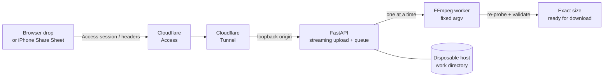

<div align="center">


**A fast, self-hosted media converter for the web and iOS Share Sheet**

Upload once · see the exact result size · download only if you want it

[](https://www.python.org)
[](https://fastapi.tiangolo.com)
[](https://ffmpeg.org)
[](https://docs.docker.com)
[](https://developers.cloudflare.com/cloudflare-one/)
[](shortcuts/spec.md)
[](LICENSE)

</div>

---

Media Manager turns a browser drop or Share Sheet tap into a safe, bounded conversion job on your own server.
Media is treated as hostile input end to end: uploads are streamed to isolated job directories,
inspected by content rather than filename, converted through a fixed allowlisted FFmpeg surface,
and re-probed before they can be downloaded. Every result expires automatically.

> **Status** — The application is locally validated. Deployment state is tracked
> outside this application repository; verify the running revision before making
> runtime claims. Apple-device PWA and Shortcut behavior requires on-device
> validation. See [deployment guide](docs/deployment.md) for the exact gates.

## Highlights

- **Preview before download** — the client sees the *exact* output byte count and decides whether to fetch it; nothing downloads by surprise.
- **Fast web workflow** — drag in one file, get immediate local format detection and relevant presets, upload once, then keep or discard the exact server result.
- **Closed conversion surface** — bounded 0–100% format-relative quality, six resolution caps, and keep/drop audio. No codec names, filter strings, bitrates, or arbitrary FFmpeg flags are accepted from clients.
- **Content-based input handling** — MIME type, extension, and original filename never select a parser. Inputs are demuxed through an explicit format allowlist with protocol whitelisting locked to `file`.
- **Hard resource ceilings** — upload/output byte caps, wall-clock timeouts per media class, dimension/duration/FPS/pixel/stream limits, one conversion at a time, disk-space admission control.
- **Origin-verified authentication** — Cloudflare Access JWTs are validated at the origin (signature, issuer, audience, expiry), so trust comes from cryptography, not forwarded headers.
- **Disposable by design** — no database, no durable queue, no user data. A restart cancels jobs and wipes the workspace.
- **Purpose-built compression** — one request automatically chooses MP4, WebP, or M4A and makes a bounded attempt to finish below 20 MB, reporting honestly when it cannot.

## Architecture



The public path ends at a loopback listener; nothing else is published to the host.

## Conversions

| Target | Output | Accepted sources |
| --- | --- | --- |
| `video-mp4` | H.264 + optional AAC | Video, animation |
| `video-webm` | VP9 + optional Opus | Video, animation |
| `image-jpeg` | JPEG | Still image |
| `image-png` | PNG | Still image |
| `image-webp` | WebP | Still image |
| `animation-gif` | Palette-generated GIF | Video, still image, animation |
| `audio-m4a` | AAC | Audio, or a video's audio |
| `audio-mp3` | MP3 | Audio, or a video's audio |
| `audio-opus` | Opus in Ogg | Audio, or a video's audio |

Input allowlist: common MOV/MP4, Matroska/WebM, AVI, MPEG, FLV, ASF, GIF, JPEG, PNG, WebP,
BMP, TIFF, MP3, AAC/M4A, WAV/AIFF, FLAC, and Ogg — subject to the codecs compiled into the
pinned image. HEIC/HEIF, AVIF, APNG, animated WebP, exotic color profiles, and camera RAW are
**not advertised** until representative fixtures pass.

## The lifecycle

```
POST /v1/uploads       →  201  { id, offset, chunk_size }       # authenticated session
PATCH /v1/uploads/{id} →  200  { offset }                       # ordered raw chunks
POST /v1/uploads/{id}/complete → 202                            # queue exact upload
POST /v1/jobs          →  202  { id, state, status_url }        # small one-request clients
GET  /v1/jobs/{id}     →  queued → inspect → convert → verify  # real progress
GET  /v1/jobs/{id}/content                                    # only after you choose to
DELETE /v1/jobs/{id}                                          # or let it expire
GET  /v1/capabilities                                         # option set + limits
POST /v1/compressions → GET /v1/compressions/{id}             # automatic <20 MB attempt
```

<details>
<summary><strong>Example ready response</strong></summary>

```json
{
  "id": "82f353b4-33ec-41dd-8466-a1a0271e398f",
  "state": "ready",
  "target": "video-mp4",
  "quality": "balanced",
  "quality_percent": 50,
  "resolution": "720p",
  "audio": "keep",
  "created_at": "2026-08-25T14:30:00Z",
  "expires_at": "2026-08-25T14:47:12Z",
  "status_url": "https://media.example.com/v1/jobs/82f353b4-33ec-41dd-8466-a1a0271e398f",
  "input": {
    "bytes": 18401932,
    "media_class": "video",
    "container": "mov,mp4,m4a,3gp,3g2,mj2",
    "duration_ms": 42100,
    "width": 3840,
    "height": 2160,
    "video_codec": "hevc",
    "audio_codec": "aac"
  },
  "output": {
    "bytes": 7131021,
    "filename": "holiday-converted.mp4",
    "media_type": "video/mp4",
    "download_url": "https://media.example.com/v1/jobs/82f353b4-33ec-41dd-8466-a1a0271e398f/content",
    "width": 1280,
    "height": 720,
    "duration_ms": 42100
  },
  "error": null,
  "progress": null
}
```

</details>

<details>
<summary><strong>Error codes</strong></summary>

Every failure uses `{"error": {"code": "...", "message": "..."}}`. Codes are stable:

| Area | Codes |
| --- | --- |
| Browser security | `CROSS_SITE_REQUEST` |
| Upload | `INPUT_TOO_LARGE`, `CHUNK_TOO_LARGE`, `EMPTY_INPUT`, `UPLOAD_TIMEOUT`, `UPLOAD_HEADER_REQUIRED`, `INVALID_UPLOAD_HEADER`, `INVALID_FILENAME`, `UPLOAD_OFFSET_MISMATCH`, `UPLOAD_INCOMPLETE`, `UPLOAD_ALREADY_COMPLETED`, `CONTENT_LENGTH_MISMATCH`, `RAW_FILE_REQUIRED`, `UNSUPPORTED_ENCODING`, `INVALID_CONTENT_LENGTH`, `INSUFFICIENT_STORAGE` |
| Options | `INVALID_OPTIONS` |
| Capacity | `QUEUE_FULL` (with `Retry-After`) |
| Authentication | `ACCESS_TOKEN_REQUIRED`, `INVALID_ACCESS_TOKEN` |
| Media | `UNSUPPORTED_MEDIA`, `UNSUPPORTED_CONVERSION`, `MEDIA_LIMIT_EXCEEDED`, `MEDIA_PROBE_TIMEOUT` |
| Processing | `PROCESSING_TIMEOUT`, `OUTPUT_TOO_LARGE`, `CONVERSION_FAILED`, `COMPRESSION_FAILED` |
| Job state | `JOB_NOT_FOUND`, `JOB_NOT_READY`, `RESULT_EXPIRED` |

Raw FFmpeg output is never returned to clients.

</details>

## Options & limits

| Option | Values |
| --- | --- |
| `quality_percent` | `0`–`100`; `50` exactly preserves the previous Balanced settings |
| `quality` | Legacy compatibility: `economy` · `balanced` · `high` map to `0` · `50` · `100` |
| `resolution` | `source` · `480p` · `720p` · `1080p` · `1440p` · `2160p` — a long-edge cap that never upscales |
| `audio` | `keep` · `drop` — video targets only |

Clients may send a percent-encoded original basename in `Upload-Filename`. It is
used only to return `<stem>-converted.<target-extension>` and never selects a
parser, codec, command, or filesystem path.

`POST /v1/compressions` accepts no conversion options. It aims for 19,000,000
bytes, reports success only below 20,000,000 bytes, and otherwise offers the
smallest valid candidate. See [`docs/api.md`](docs/api.md).

| Resource | Default limit |
| --- | ---: |
| Upload / output size | 5 GiB / 5 GiB |
| Authenticated chunk size | 50 MiB |
| Live jobs (incl. retained results) | 1 |
| Concurrent conversions | 1 |
| Upload wall time | 5 minutes |
| Audio/video duration | 10 minutes |
| GIF duration / input pixels | 15 s / 4 MP |
| Visual dimensions | 50 MP total · 16,384 px per axis |
| Result retention | 15 minutes |
| Incomplete upload retention | 2 hours since the last chunk |

## Authentication

Browser users authenticate through an interactive Cloudflare Access policy. Automation clients
present a **service token** (`CF-Access-Client-Id` / `CF-Access-Client-Secret`) on every request.
Cloudflare authenticates either identity at the edge;
the API then independently verifies the injected `Cf-Access-Jwt-Assertion` before any work
happens. Jobs belong to their principal — another principal gets the same `404` as a missing job.

The server stores **no secrets**: only non-secret Access metadata (issuer, audience, public
origin). Service tokens live solely on authorized devices — never in `.env`, Git, logs, the web
frontend, or an exported Shortcut. Use one dedicated short-lived token per device under a
`Service Auth` policy, and cover the web root and `/assets/*` with the same Access application as
`/v1/*`.

## Getting started

**Local development** (Python 3.12+, `uv`, FFmpeg):

```powershell
uv sync --all-groups

$env:MEDIA_MANAGER_AUTH_MODE = "disabled"
$env:MEDIA_MANAGER_PUBLIC_BASE_URL = "http://127.0.0.1:8080"
uv run uvicorn media_manager.main:app --host 127.0.0.1 --port 8080
```

What it does: starts the API on loopback with authentication disabled for local testing only —
never use this mode beyond your own machine.

Open `http://127.0.0.1:8080` for the web interface. It uses no build step, external assets,
or trackers. Only an active post-upload job ID is kept in session storage for iOS recovery;
file type and preview metadata are detected locally for speed;
FFmpeg still verifies the uploaded contents before producing any result.

**Checks:**

```powershell
uv run ruff check .
uv run pytest
docker compose --env-file .env.example config --quiet
```

What it does: lints, runs all tests (including real-FFmpeg conversion of every target), and
validates Compose syntax without rendering production values.

**Production image:**

```bash
revision="$(git rev-parse HEAD)"
docker build --build-arg SOURCE_REVISION="$revision" --tag "media-manager:$revision" .
```

What it does: builds the digest-pinned image from a clean commit and labels it with that revision.

## iPhone PWA and Shortcuts

The installable PWA provides safe-area-aware controls, resumable network uploads,
recoverable post-upload polling, and native Share/Save handling. See
[`docs/pwa.md`](docs/pwa.md).

[`shortcuts/spec.md`](shortcuts/spec.md) defines two credential-free native
automations: Convert Media asks only for the output format; Compress Media asks
no conversion questions and naturally attempts to finish below 20 MB.

Honest platform note: Apple has no supported way to create, sign, and silently install a
Shortcut from Windows. The intended flow is authoring the graph once on an Apple device,
exporting a credential-free master, and distributing via iCloud link or signed file — import
stays user-confirmed. [`shortcuts/tests/on-device.md`](shortcuts/tests/on-device.md) gates releases.

## Documentation

| Document | Contents |
| --- | --- |
| [`docs/security.md`](docs/security.md) | Threat model, enforced invariants, container controls, residual risks, verification checklist |
| [`docs/deployment.md`](docs/deployment.md) | Deployment guide: architecture, pre-deployment gates, validation matrix, rollback |
| [`docs/api.md`](docs/api.md) | Conversion, resumable upload, compression, progress, filename, and lifecycle contracts |
| [`docs/pwa.md`](docs/pwa.md) | iPhone interaction, recovery, update, sharing, and validation behavior |
| [`docs/performance.md`](docs/performance.md) | Safe optimizations, benchmark evidence, and excluded trade-offs |
| [`docs/history.md`](docs/history.md) | Date-addressable project activity and verification record |
| [`shortcuts/README.md`](shortcuts/README.md) | Security model for tokens, authoring/export workflow, release gate |
| [`docs`](docs/) · [`shortcuts`](shortcuts/) · [`tests`](tests/) | Everything above, plus the test suite |

## License

Media Manager's original source and documentation are available under the
[MIT License](LICENSE). Docker images also contain third-party software under
its own licenses, including a GPL-enabled FFmpeg build; see
[`THIRD_PARTY_NOTICES.md`](THIRD_PARTY_NOTICES.md) before redistributing an
image.

## Repository layout

```text
media-manager/
├── src/media_manager/     # FastAPI app, conversion engine, auth, and zero-build web UI
├── tests/                 # API, auth, and real-FFmpeg integration suites
├── shortcuts/             # Credential-free native Shortcut spec + release gate
├── docs/                  # Security model and deployment preparation
├── Dockerfile             # Digest-pinned, non-root, read-only-friendly
└── compose.yaml           # Loopback-only hardened service definition
```

<div align="center">

**Non-goals**, stated plainly: durable jobs · URL imports · archives/documents/SVG/camera RAW ·
stream copy · metadata preservation · guaranteed smaller files · supporting everything FFmpeg can parse.

</div>
